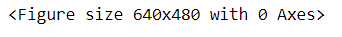

# Canny-Edge-Detection

## To implement the Canny edge detection algorithm on an image

## PYTHON PROGRAM
```
Register Number : 212221243002
Developed by    : Sanjay S
```
```python
import cv2
import matplotlib.pyplot as plt
```
```python
san = 'san.jpg'
san2 = cv2.imread(san, cv2.IMREAD_GRAYSCALE)
```
```python
if san2 is None:
    print("Error: Could not load image")
    exit()
```
```python
edges = cv2.Canny(san2, threshold1=100, threshold2=200)
```
```python
plt.figure(figsize=(10, 5))
```


```python
plt.subplot(1, 2, 1)
plt.title('Original Image')
plt.imshow(san2, cmap='gray')
plt.axis('off')
```


```python
plt.subplot(1, 2, 2)
plt.title('Edges')
plt.imshow(edges, cmap='gray')
plt.axis('off')
```


```python
plt.tight_layout()
plt.show()
```


```python
parameters = [
    (50, 150),  
    (100, 200),
    (150, 250)
]
```
```python
san2 = cv2.imread(san, cv2.IMREAD_GRAYSCALE)
plt.figure(figsize=(15, 5))
```


```python
for i, (threshold1, threshold2) in enumerate(parameters):
    edges = cv2.Canny(san2, threshold1, threshold2)
    plt.subplot(1, 3, i + 1)
    plt.title(f'Thresholds: {threshold1}, {threshold2}')
    plt.imshow(edges, cmap='gray')
    plt.axis('off')
```


```python
plt.tight_layout()
plt.show()   
``` 

